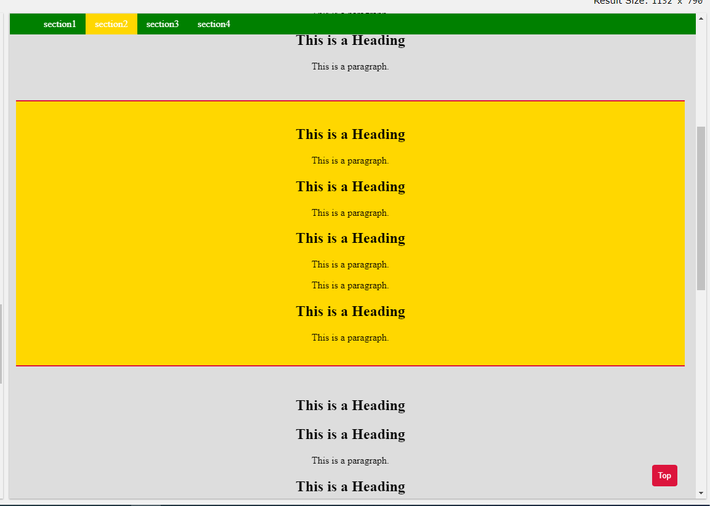

# landing_example
simple landing page project example Read Only

Check it online:
http://18.196.30.95/landing-project-udacity

* landing_scroll_use_data.html : I used data attrubite to scroll to the target section without # in the href.

* landing_without_data: I Used hash + section id inside the link href to scroll to the target section.

*  Add an active state to your navigation items when a section is in the viewport.
*  Hide fixed navigation bar while not scrolling (it should still be present on page load).
*  Hint: setTimeout can be used to check when the user is no longer scrolling.
*  Add a scroll to top button on the page that’s only visible when the user scrolls below the fold of the page.
*  Update/change the design/content.
*  Make sections collapsible.
